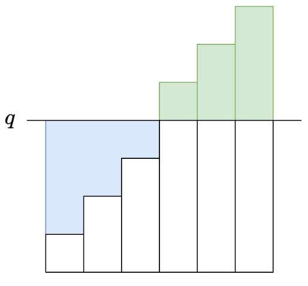

[Problem: 2602. 使数组元素全部相等的最少操作次数](https://leetcode.cn/problems/minimum-operations-to-make-all-array-elements-equal/description/)

### 方法：排序+前缀和+二分（清晰题解）

题意：每个元素都能加减 $1$，目标是让所有元素相同

对于两个元素 $x$ 和 $y$ 来说，假定最后相同的数为 $q$，那么求的就是距离之和，即 $|x-q|+|y-q|$。对于每个点 $x_i$，它的距离是 $|x_i-q|$，最后的答案就是 $\sum_{i=1}^{n}(|x_i-q|)$。

暴力求解时，变成一个数 $tar$ 就要遍历一次数组，那么最后的时间复杂度为 $O(nm)$，其中 $n$ 和 $m$ 分别为数组 $nums$ 和 $queries$ 的长度，显然超时。

### 前缀和

实际上，每次求的都是一堆数与一个数的差，而总的数不会变。将上面的数学公式转化一下，可以得到：

$$
\begin{array}{rl}
\sum_{i=1}^{n}(|x_i-q|)
&= \sum(q-x_i)+\sum(x_j-q)\\
&= n*q-\sum{x_i}+\sum{x_j}
\end{array}\\
$$

$$
其中 x_i\leq q, x_j\geq q
$$

很明显，$\sum{x_i}$ 这一项可以提前算出，也就是前缀和思路。

对于子数组的求和，前缀和可以做到 $O(n)$ 提前算，$O(1)$ 得到答案，是比较常用的一种思想。

这里使用数组 $[1,2,3,4,5]$ 举例，解释前缀思想。定义一个前缀数组 $pre$，其中 $pre[i]$ 表示数组 $nums$ 的区间 $[0,i]$ 的累加和。

- $pre[0]$ 对应 $nums[0,0]$，所以 $pre[0]=nums[0]=1$
- $pre[1]$ 对应 $nums[0,1]$，所以 $pre[1]=pre[0]+nums[1]=3$
- $pre[2]$ 对应 $nums[0,2]$，所以 $pre[2]=pre[1]+nums[2]=6$
- ...

对于任意一个片段 $[i,j]$ 的子数组求和，只需要使用 $pre[j+1]-pre[i]$ 即可得到。

### 排序 + 二分

本题的公式要求小于 $q$ 的数累加（$\sum$ 前为负号），大于 $q$ 的数累加（$\sum$ 前为正号）。$nums[i]$ 与 $q$ 大小关系未知，难不成遍历一遍数组得知每个数与 $q$ 进行比较？前缀和用在哪里了？

为了将小的数与大的数分离，很自然的想到排序。排序数组后，小数在前，大数在后，那就可以使用前缀和啦！

不过有一点需要注意，前缀和求子数组和的时候，用的是下标 $i$ 和 $j$。假设小于 $q$ 的最后一个数的下标为 $t$，要求的就是前缀和 $\sum_{i=1}^{t}x_i$ 与 $\sum_{i=t}^{n}x_i$。

如何快速得出这个下标 $t$ 呢？从前往后遍历那可就太暴力了，经典方法当然是二分了。这里我不多作阐述，详细二分模版及介绍，可以看看 labuladong 大佬的 [二分查找](https://leetcode.cn/problems/binary-search/solutions/8337/er-fen-cha-zhao-xiang-jie-by-labuladong/) 。

### 图解

上面的解释也许有点干巴，这里放上灵神的图用来形象解释。其中的柱形就是数 $nums[i]$，从左到右逐渐升高，$n*q$ 就是横线下方的大矩形面积，横线下方的蓝色面积就是 $\sum(q-x_i)$，横线上方的绿色面积就是 $\sum(x_j-q)$。



求前缀和累加的时候注意 $int$ 会越界，记得使用 $long$ 哦！

```Python
# python
class Solution:
    def minOperations(self, nums: List[int], queries: List[int]) -> List[int]:
        # 排序+前缀和+二分
        # 使用排序+二分找到需要修改的数在所有数中的位置
        # 使用前缀和能快速计算出矩形的面积，减去前缀和就是需要操作的值
        n = len(nums)
        nums.sort()
        s = list(accumulate(nums, initial = 0))  # 前缀和
        ans = []
        for q in queries:  # 二分查找需要修改的数的位置
            j = bisect_left(nums, q)  # 找到那个下标
            left = q * j - s[j]  # 左侧面积
            right = s[n] - s[j] - q * (n - j)  # 右侧面积
            ans.append(left + right)
        return ans
```

```java
// java
class Solution {
    public List<Long> minOperations(int[] nums, int[] queries) {
        Arrays.sort(nums);
        int n = nums.length;
        long[] sum = new long[n + 1]; // 前缀和
        for (int i = 0; i < n; i++) {
            sum[i + 1] = sum[i] + nums[i];
        }

        List<Long> ans = new ArrayList<>(queries.length);
        for (int q : queries) {
            int j = lowerBound(nums, q);
            long left = (long) q * j - sum[j]; // 蓝色面积
            long right = sum[n] - sum[j] - (long) q * (n - j); // 绿色面积
            ans.add(left + right);
        }
        return ans;
    }

    // 二分模版
    private int lowerBound(int[] nums, int target) {
        int left = -1;
        int right = nums.length; // 开区间 (left, right)
        while (left + 1 < right) { // 区间不为空
            // 循环不变量：
            // nums[left] < target
            // nums[right] >= target
            int mid = left + (right - left) / 2;
            if (nums[mid] < target) {
                left = mid; // 范围缩小到 (mid, right)
            } else {
                right = mid; // 范围缩小到 (left, mid)
            }
        }
        return right;
    }
}
```

- 时间复杂度：_O((n+m)logn)_，其中 $n$ 和 $m$ 分别为 $nums$ 和 $queries$ 的长度
- 空间复杂度：_O(n)_，前缀和数组的开销

> ps：感谢灵神的思路分享，欢迎大家关注这位大佬 @灵茶山艾府

> 题解已发布力扣平台 [我的题解](https://leetcode.cn/problems/minimum-operations-to-make-all-array-elements-equal/solutions/2842529/pai-xu-qian-zhui-he-er-fen-fei-chang-qin-biux/)
